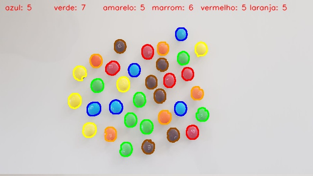

# processamento_objetos
Esse projeto processa duas imagens diferente e tem como objetivo segmentar os objetos da imagem e realizar a contagem de ambos.

## Imagens de Entrada

### Células

### MM's

## Imagens de Saída

### Células

### MM's

